<h1>Projet Spring Boot - Gestion des Comptes</h1>

Ce projet couvre différentes étapes pour créer et tester une application Spring Boot pour la gestion des comptes, en suivant les questions fournies.

<h2>1. Créer un projet Spring Boot avec les dépendances Web, Spring Data JPA, H2, Lombok</h2>
    
<strong>Description :</strong> Initialiser un projet Spring Boot avec les dépendances nécessaires pour la gestion des comptes.

<h2>2. Créer l'entité JPA Compte</h2>

<strong>Description :</strong> Définir l'entité <code>Compte</code> avec des attributs tels que <code>id</code>, <code>balance</code>, et <code>currency</code>.

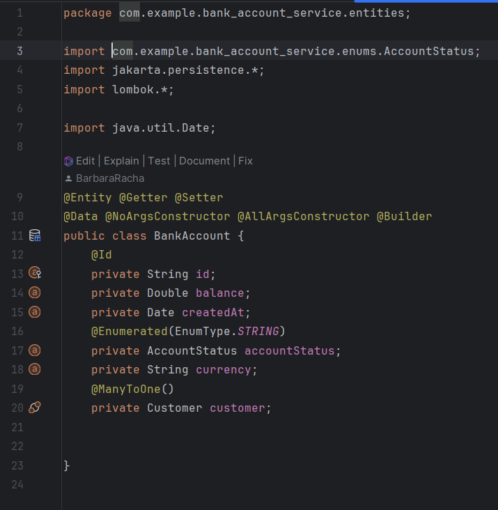

<h2>3. Créer l'interface CompteRepository basée sur Spring Data</h2>

<strong>Description :</strong> Créer un repository qui étend <code>JpaRepository</code> pour gérer les entités <code>Compte</code>.

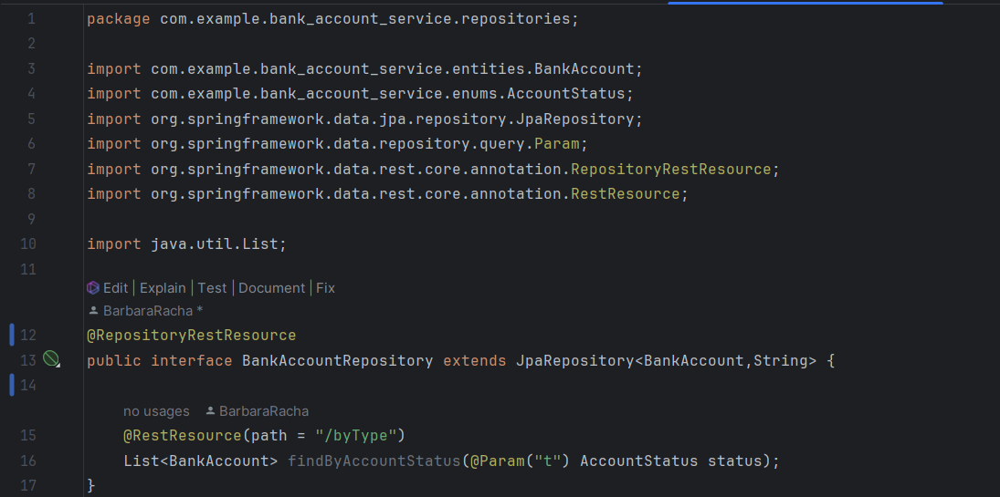

<h2>4. Tester la couche DAO</h2>

<strong>Description :</strong> Tester les méthodes CRUD de <code>CompteRepository</code> avec une base de données en mémoire H2.

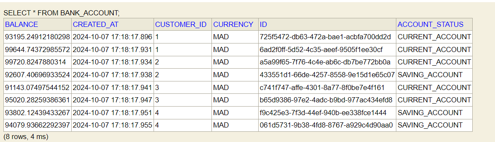

<h2>5. Créer le Web service Restful qui permet de gérer des comptes</h2>

<strong>Description :</strong> Créer un service Rest qui permet d'effectuer des opérations sur les comptes (ajouter, supprimer, modifier).

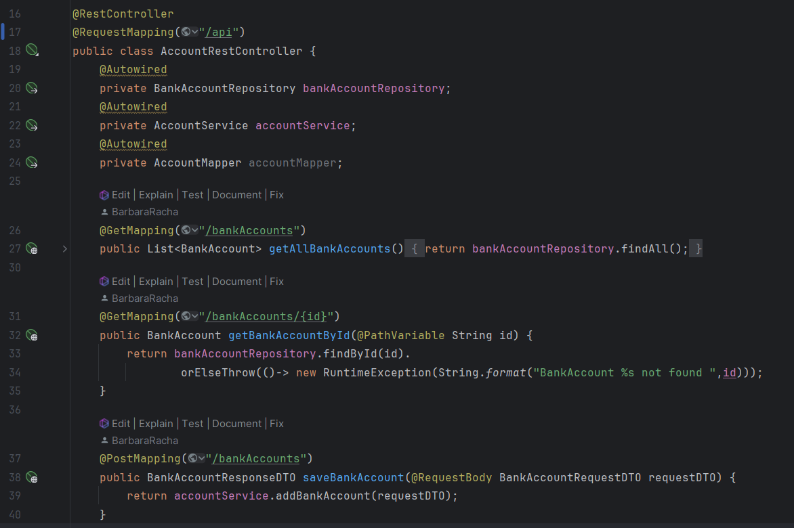

<h2>6. Tester le web micro-service en utilisant un client REST comme Postman</h2>

<strong>Description :</strong> Tester les points d'entrée de l'API Rest avec Postman.

Exemple de méthode GET :

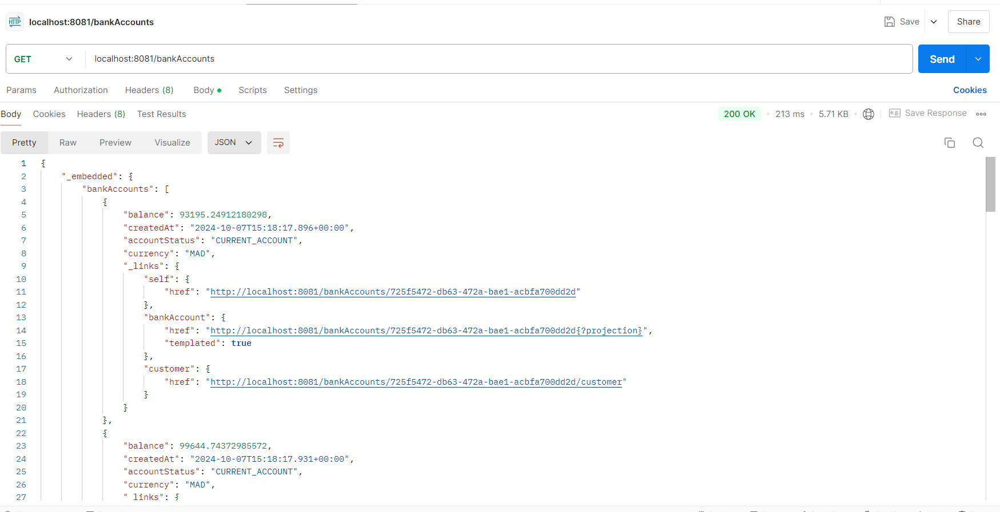

Exemple de méthode POST :

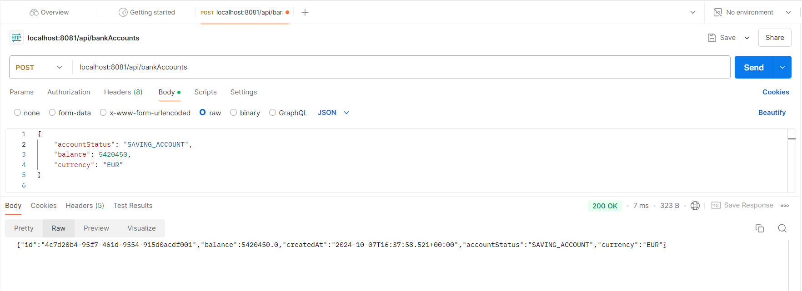

<h2>7. Générer et tester la documentation Swagger des API Rest du Web service</h2>

<strong>Description :</strong> Ajouter la documentation Swagger pour décrire les endpoints de l'API.

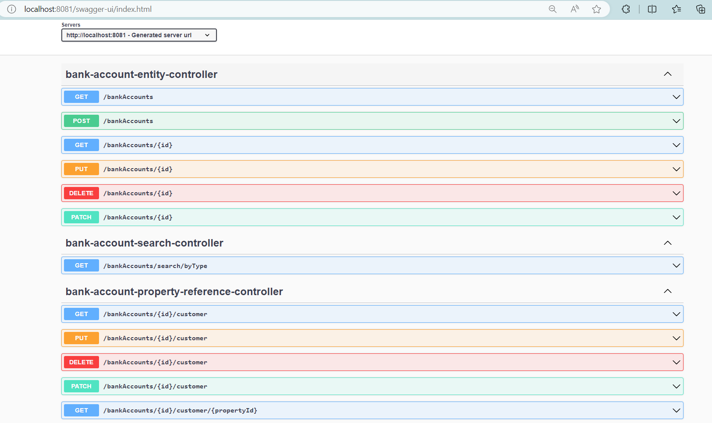

<h2>8. Exposer une API Restful en utilisant Spring Data Rest en exploitant des projections</h2>

<strong>Description :</strong> Exposer des projections pour les entités afin de limiter les données exposées via l'API Rest.

Déjà illustré : <code>@RepositoryRestResource</code>

<h2>9. Créer les DTOs et Mappers</h2>

<strong>Description :</strong> Implémenter les DTOs (Data Transfer Objects) et les mappers pour transformer les entités en objets adaptés au transfert via l'API.

BankAccountRequestDTO &amp; BankAccountResponseDTO

<h2>10. Créer la couche Service (métier) et du micro service</h2>

<strong>Description :</strong> Implémenter la couche service pour la logique métier et l'intégration avec l'API.

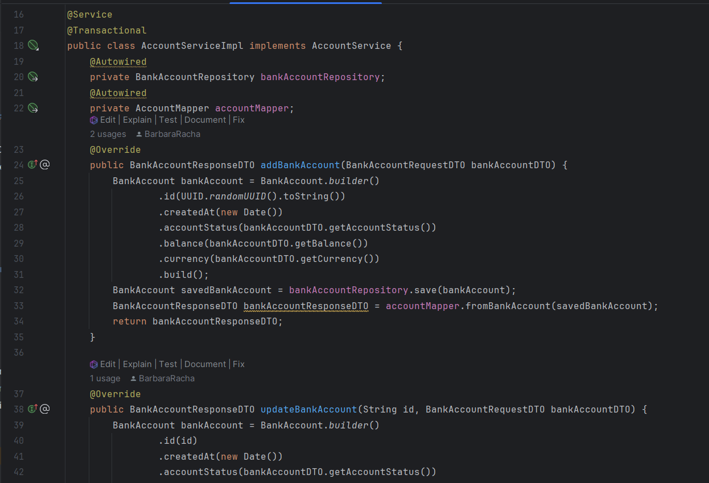

<h2>11. Créer un Web service GraphQL pour ce Micro-service</h2>

<strong>Description :</strong> Implémenter un service GraphQL pour l'interrogation des données de compte.

Schema "GraphQL"

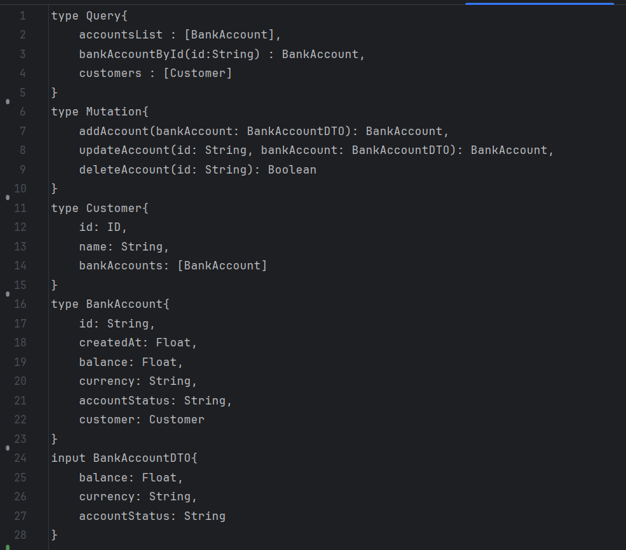

Classe "AccountGraphQLController"

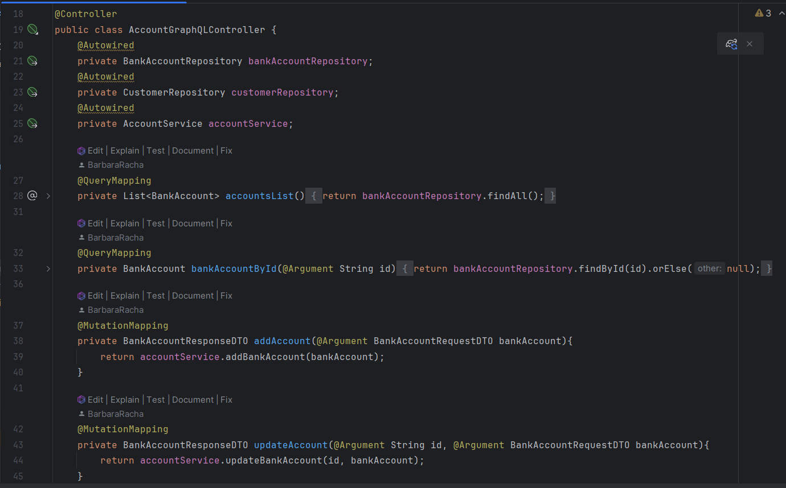

<h2>Quelques Affichages avec GraphQL</h2>
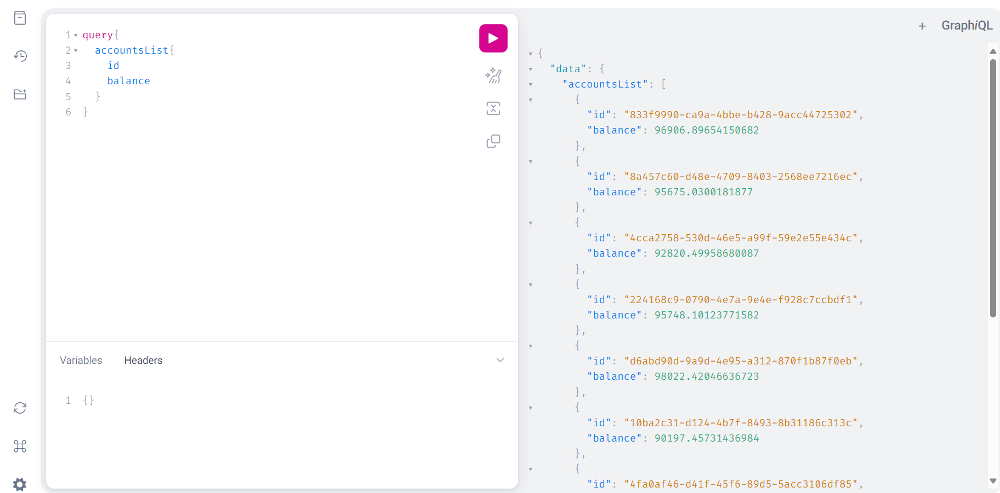

